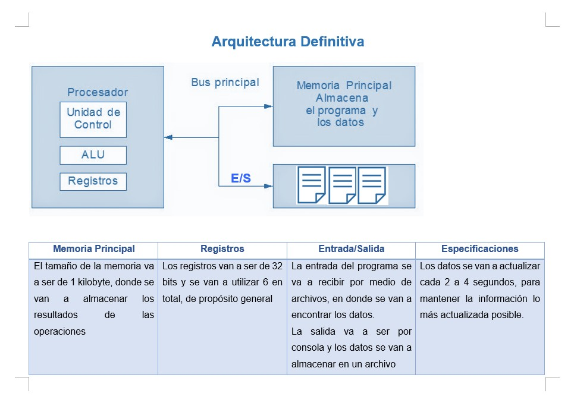

# Proyecto PI - Los Pingüinos

Nombre de equipo: Pingüinos

Logo del equipo: 

## Integrantes

- David Rojas - B96873
- Gabriel Revillat - B86524
- Maria Jesús Vargas - B98243

## Descripción Breve

El proyecto consiste de un programa que se encarga de recibir datos de un lugar en especifico con personas, se encarga de revisar la distancia, la temperatura y el uso de mascarilla de estos. Se procesan los datos y en caso de que suceda alguna anomalía surge una alerta.

## Descripción Detallada

#### Arquitectura

##### Imagen Arquitectura

##### Registros
El sistema cuenta con 6 registros de propósitos general de 32 bits cada uno

##### Memoria
El tamaño de memoria que se utilizará es de 1KB.

##### Entrada/Salida de datos
El sistema recibe los datos mediante archivos (formato a definir). Estos datos se procesan y los
resultados son enviados a la memoria.

Cuando se desea sacar los resultados, la información se guardará en un archivo de texto y los
resultados serán desplegados en consola.

##### Refrescamiento de Datos
Según lo planeado, los resultados serán actualizados una vez en un intervalo de 2 a 4 segundos.

#### Detalles de implementación

En términos de programación la solución será implementada utilizando lenguaje ensamblaador
y c++.

La señal que representa una anomalía se mostraría en consola y en principio tendriamos alguna forma de desactivar esa alarma.
